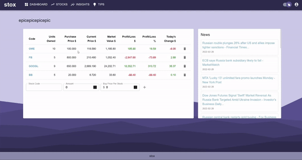

# stox

## About stox

Stox is a stock portfolio management web app, implemented using the MERN stack (MongoDB, ExpressJS, React, and NodeJS).

This project was completed from scratch as part of uni coursework, in a team of five. The final mark was 96/100.

## Features

- Viewing individual stocks and relevant information
    - A stock can be searched for and its information such as price history can be viewed.

- Creating and managing portfolios and watchlists
    - Users can catagorise the stocks they own or are watching, view their trends and a summary of earnings.

- Viewing trending stocks among other users
    - When stocks are viewed or added to portfolios their trending score increases.

- Sentiment analysis on news articles related to stocks
    - Scraping data from related news articles to estimate the general sentiment of a stock.

- New investor investment assistance
    - An interactive guide for the website.

- Account management
    - Authorisation and authentication 

## Installation Guide

Assuming that node and npm are installed properly, from the root project directory run:

1. `npm install`
2. `npm run installer`

## Quick Start

From root project directory run:

1. `npm run dev`

Note that a valid MongoDB URI, as well as AlphaVantage and NewsAPI keys are needed for proper functionality. These can be added in the file `backend/keys.js`.

### APIs

- **AlphaVantage:** Retrieval of historical and current stock information
- **NewsAPI:** Retrieval of recent, stock-relevant news stories
